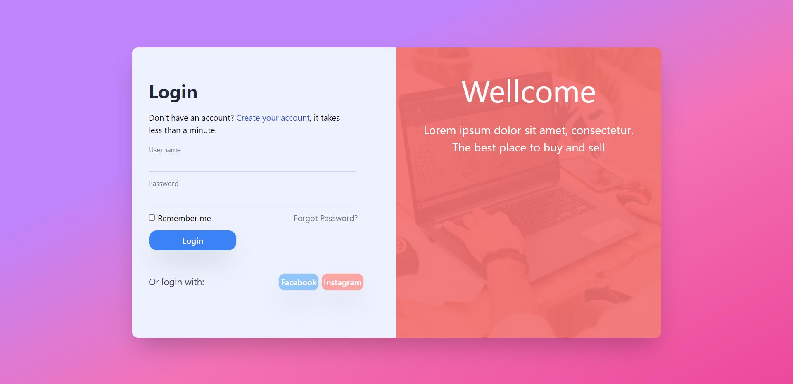

<h1 align='center'>Meu primeiro projeto com Tailwind</h1>

### Objetivo: Praticar o uso de Tailwind pela 1° vez
1. Consegui usar Tailwind com uma certa facilidade, exceto pela parte de position (tenho que treinar mais).
2. Aprendi como criar classes no tailwind usando um arquivo `style.css` e linkando ele no arquivo `output`, importando os dados necessários e utilizando @apply

### O que Praticar:
1. Uso de positions.
2. Before e After.
3. Responsividade.

### Como ficou o projeto:

### Considerações finais:
Achei bem flexivel a biblioteca, possui uma excelente documentação, fácil acesso e muitas opções de estilos diferentes.
Por mais que Tailwind seja uma biblioteca de fácil uso, ainda sinto que tenho muito o que melhorar.

### Referência:
1. Layout: https://www.uplabs.com/blackrosepham1905
2. Imagem: https://www.pexels.com/pt-br/
3. Documentação: https://tailwindcss.com/docs/installation
4. Curso de apoio: https://www.youtube.com/playlist?list=PLcoYAcR89n-r1m-tMfV4qndrRWpT_rb9u
